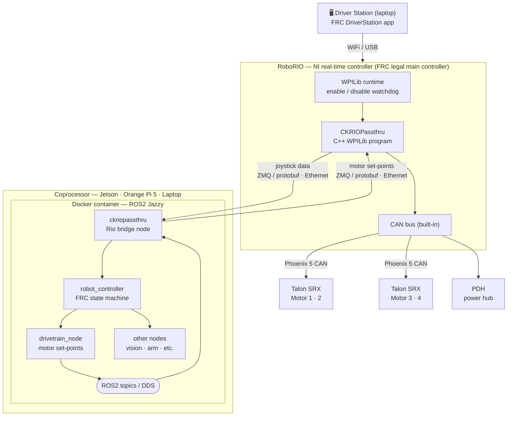
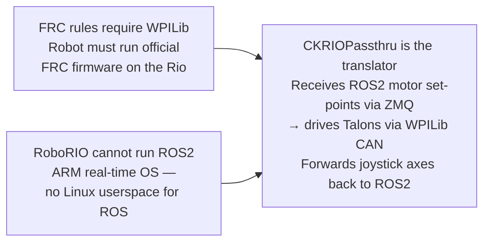

# ROS2_Sample_Robot
[](https://github.com/frcteam195/ROS2_Sample_Robot/actions/workflows/main.yml)

This is the main robot project. All nodes used in the robot should be defined in ros_projects.txt and all third party libraries should be defined in third_party_projects.txt. In order to run this project, you need to have [ros_dev](https://github.com/frcteam195/ros2_dev) at the same directory level as this repository. Then you can run `./ros_dev/mkrobot.sh clone` to pull all the node and third party libraries and then run `./ros_dev/mkrobot.sh build` to build all the nodes. To deploy to the ROS robot, run `./ros_dev/mkrobot.sh deploy`. The naming standard for nodes is `[nameofnode]_[year]_node`.

### ROS2 Intended Architecture

Below is the intended architecture if implemented ROS2 for FRC 2026 and beyond! This architecture is based on FRC Team 195.



#### Why CKRIOPassthru exists



#### Data flow summary

```
Driver Station → RoboRIO (enable signal)
              → CKRIOPassthru (WPILib)
              → Ethernet (ZMQ/protobuf)
              → ckriopassthru node (ROS2)
              → robot_controller
              → drivetrain_node
              → Ethernet (ZMQ/protobuf)
              → CKRIOPassthru (WPILib)
              → Talon SRX (CAN bus)
              → Motors
```

---

### Robot Nodes

[ros2 ck messages](https://gitlab.team195.com/cyberknights/ros2/robots/sample_robot/ck_ros2_msgs_node.git)

[ros2 dashboard interface](https://gitlab.team195.com/cyberknights/ros2/robots/sample_robot/dashboard_interface_node.git)

[ros2 drivetrain](https://gitlab.team195.com/cyberknights/ros2/robots/sample_robot/drivetrain_node.git)

[ros2 health monitor](https://gitlab.team195.com/cyberknights/ros2/robots/sample_robot/health_monitor_node.git)

[ros2 hmi agent](https://gitlab.team195.com/cyberknights/ros2/robots/sample_robot/hmi_agent_node.git)

[ros2 ck base messages](https://gitlab.team195.com/cyberknights/ros2/utility-nodes/ck_ros2_base_msgs_node.git)

[ros2 ck utillities](https://gitlab.team195.com/cyberknights/ros2/utility-nodes/ck_utilities_node.git)

[ros2 ck pythoon utillities](https://gitlab.team195.com/cyberknights/ros2/utility-nodes/ck_utilities_py_node.git)

[ros2 frc robot utillities](https://gitlab.team195.com/cyberknights/ros2/utility-nodes/frc_robot_utilities_node.git)

[ros2 frc python robot utillities](https://gitlab.team195.com/cyberknights/ros2/utility-nodes/frc_robot_utilities_py_node.git)

[ros2 logger](https://gitlab.team195.com/cyberknights/ros2/utility-nodes/logger_node.git)

[ros2 phoenix pro](https://gitlab.team195.com/cyberknights/ros2/utility-nodes/phoenixpro_control_node.git)

[ros2 rio control](https://gitlab.team195.com/cyberknights/ros2/utility-nodes/rio_control_node.git)

[ros2 swerve drivetrain](https://gitlab.team195.com/cyberknights/ros2/utility-nodes/swerve_drivetrain_node.git)


---

### Third Party Projects

[ROS2_ProtoDef](https://github.com/frcteam195/ROS2_ProtoDef.git)